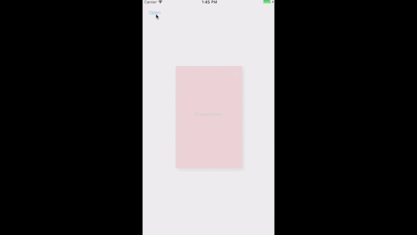

ios PopupView Sample



# PopupView

## Usage

###Example usage: *.h ( PopupViewController.h )

```objc
#import <UIKit/UIKit.h>
#import "PopUpHelperViewController.h"
@protocol PopupDelegate;


@interface PopUpViewController : UIViewController

@property (assign, nonatomic) id <PopupDelegate>delegate;

@end

```

###Example usage: *.m (PopupViewController.m)

```objc
-(IBAction)closeView:(id)sender {
    if (self.delegate && [self.delegate respondsToSelector:@selector(cancelButtonClicked)]) {
        [self.delegate cancelButtonClicked];    
    }
}
```

## Author

minjoongkim, kmj6773@gmail.com

## License

PopupView is available under the MIT license. See the LICENSE file for more info.
